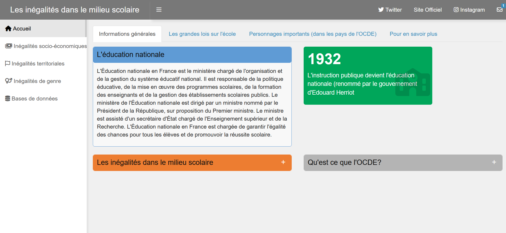
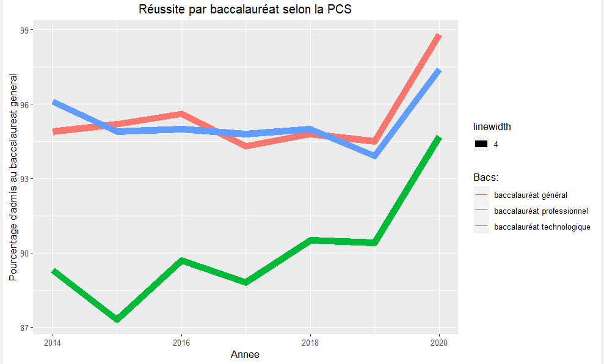
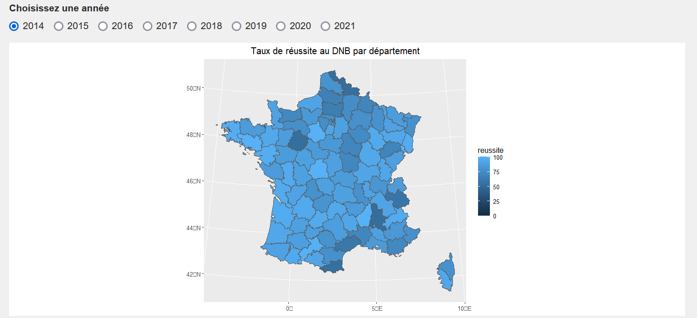

# [Projet de visualisation de données]{.underline}

Lien de notre application WEB

## Introduction

L'éducation représente "l'art de former une personne en développant ses
capacités physiques, intellectuelles et morales, de façon à lui
permettre d'affronter sa vie personnelle et sociale avec une
personnalité suffisamment épanouie". C'est donc un élément majeur dans
le développement économique et social d'un pays. Dans notre société,
l'éducation est considérée comme un outil clé pour briser les barrières
sociales et économiques. Cependant, de nombreuses inégalités existent
entre les individus dans ce domaine. Ces disparités se traduisent par
différents exemples comme l'inégalité d'accès face à l'éducation, les
écarts de niveaux de vie entre les pays mais aussi entre les familles.
Elles peuvent donc avoir des conséquences néfastes sur la vie des
individus.\
Ainsi, nous avons choisi d'étudier les causes et les conséquences des
inégalités dans le domaine de l'éducation.\
Notre objectif étant de mieux comprendre les enjeux et les défis des
différents systèmes éducatifs des pays de Organisation de coopération et
de développement économique (OCDE), et plus particulièrement, en France.
Notre application est principalement conçue pour observer ces inégalités
et leurs évolutions entre 2014 et 2021.

## L'application

Au fil des années, le système éducatif s'est construit et a été l'objet
de nombreux changements et améliorations. Par exemple, l'accès à l'école
pour les milieux défavorisés et pour les femmes. montrent un progrès
significatif dans ce domaine. Notre application a pour but de montrer
ces évolutions dans le domaine de l'éducation. Dans notre cas, nous nous
sommes concentrées sur des pays globalement assez développés puisqu'ils
font partis de l'OCDE. Nos analyses ne sont donc pas exhaustives et ne
sont pas représentatives de tous les pays du monde. Cependant, elles
permettent aussi de se rendre compte de différences entre les individus
selon leurs origines dans le système scolaire.

Tout d'abord, l'idée générale de l'application est d'être interactive et
ludique. L'utilisateur peut donc l'explorer grâce à différents onglets
et peut choisir de se focaliser sur un pays ou une période donnée. Il a
la possibilité de sélectionner le pays sur lequel il souhaite en savoir
davantage. Il peut aussi sélectionner une année afin d'analyser les
changements dans différents secteurs du système éducatif. Grâce aux
différents sélecteurs, l'utilisateur peut analyser les évolutions sur
une année ou un lieu bien précis.

Ensuite, pour avoir une application claire et facile d'utilisation, nous
avons fait le choix de créer une application sous format de tableau de
bord. Le package dashboard nous permet d'utiliser cette mise en page
avec dashboardPage() contenant :\
- dashboardHeader()\
- dashboardSidebar()\
- dashboardBody()

Lors de l'ouverture de notre site, la page d'accueil présente
globalement notre sujet, expose certaines grandes lois et personnalités
ayant marqué l'histoire de l'éducation dans différents pays de l'OCDE.
Elle est assez simple mais permet à l'utilisateur d'entrer dans notre
application progressivement. Elle présente et définit les notions clés
de notre projet.

Notre sujet traitant de diverses inégalités dans le milieu scolaire,
nous avons souhaité les examiner dans différents onglets. La mise en
place d'un menu permet d'organiser notre application. En effet, celui-ci
comprend la page d'accueil, trois pages au sujet des inégalités
socio-économiques, territoriales et de genre dans l'éducation et une
dernière regroupant les sources et bases de données.

Lors de notre projet, l'esthétique et l'ergonomie de notre application
ont été primordiales puisqu'elles permettent à l'utilisateur de saisir
les enjeux fondamentaux de notre sujet et de naviguer plus facilement.
Nous avons donc utilisé différents packages pour parvenir à nos fins. La
principale librairie pour le traitement des données que nous avons
utilisé est tidyverse comme décrit ci-dessous.

[Pour la programmation R]{.underline} :

-   librarie **tidyverse** : inclut de nombreux packages R tels que
    dplyr, ggplot2, tidyr, readr, forcats, purrr et d'autres encore. Ce
    package permet donc de filtrer, trier, sélectionner et agréger des
    données, de nettoyer et mettre en forme des donnéesréer des
    graphiques personnalisés et des visualisations.

-   packages **readr / readxl** : permet de lire et d'importer certaines
    types de fichiers

-   package **ggplot2** : package de visualisation de données nous
    permettant de créer des graphiques originaux et plus esthétiques

-   package **rAmCharts** : permet de créer des graphiques interactifs
    basés sur la librairie AmCharts. Cette librairie offre une variété
    de graphiques interactifs et esthétiquement plaisants.

-   package **DT** : permet de créer des tableaux interactifs pour la
    visualisation et l'analyse des données

-   package **treemap** : permet de créer des graphiques de treemaps,
    une technique de visualisation de données qui permet de représenter
    les données hiérarchiques sous forme de rectangles imbriqués les uns
    dans les autres.

-   package **leaflet** : permet de visualiser des données géographiques
    offrant des cartes interactives personnalisables avec une gamme de
    fonctionnalités pour faciliter l'exploration et la présentation de
    ces données.

[Pour l'ergonomie et esthétique de l'application :]{.underline}

-   package **shiny** : permet la création d'applications Web
    interactives en R

-   package **shinyWidgets** : offre des fonctionnalités supplémentaires
    à l'utilisateur comme des curseurs, boutons, cases à cocher, listes
    déroulantes, des jauges, des tableaux de bord, des cartes et des
    graphiques interactifs

-   package **dashboardthemes** / **shinythemes** : fournissent des
    thèmes afin de personnaliser notre tableau de bord

<!-- -->

Par ailleurs, nous pouvons discuter du contenu même de notre
application. Lors de ce projet, nous avons analysé trois grands axes
avec 3 onglets présentant des graphes assez variés.\
D'une part, dans l'onglet traitant des inégalités socio-économiques,
nous avons choisi de réaliser une treemap, un digramme circulaire pour
des études à un moment précis mais aussi une courbe pour observer les
changements sur une période. Suite à ces différents travaux, nous
pouvons donc dire que la répartition des classes sociales au collège est
très différente de celle du lycée. Effectivement, notre premier
graphique montre une prédominance pour les classes favorisées ou
défavorisées, selon les départements. En revanche, notre diagramme
circulaire prouve le contraire en présentant une répartition plutôt
égalitaire entre les Professions et Catégories Sociales au lycée. Enfin,
l'utilisateur peut sélectionner une classe sociale spécifique pour voir
si celle-ci a un impact sur la réussite au baccalauréat des élèves. Par
exemple, lorsque l'on sélectionne la catégorie Ouvriers, on peut voir
une croissance très importante des élèves réussissant en baccalauréats
professionnels comme le montre le graphique ci-dessous. Ces données
varient selon l'origine sociale de l'élève.

Dans cet onglet, nous avons essayé de privilégié le côté interactif pour
stimuler l'utilisateur au maximum.\
D'autre part, dans le second onglet, nous avons mis l'accent sur le côté
géographique en réalisant différentes cartes de la France ou du monde.
Nous avons aussi décidé de commenter chaque graphique afin de pouvoir
constater les disparités plus facilement. Par exemple, le taux de
réussite au Diplôme National du Brevet nous semblait être pertinent à
étudier, c'est pourquoi nous avons réalisé cette carte :

Afin d'avoir de multiples représentations, nous avons tenté de créer des
cartes leaflet, sf et ggmap pour avoir un rendu assez varié.\
Enfin, le dernier onglet a aussi pour but de sensibiliser le public de
notre application. Il permet de prendre conscience des discriminations
de genre qui peuvent exister et des normes sociales qui peuvent
favoriser un genre ou l'autre. L'objectif est donc de lutter contre les
stéréotypes créés au fil du temps. En abordant les inégalités de genre,
nous aidons les individus à comprendre les défis du système éducatif.
Ainsi, nous avons réalisé différents graphiques pour représenter ce
sujet

## Les limites de notre application

En dernière analyse, nous pouvons présenter les limites et les
contraintes rencontrées lors de la conception de notre application WEB.

Premièrement, le sujet que nous abordons est très complet et nous
aurions pu faire une analyse encore plus exhaustive. Cependant, nous
avons du sélectionner les sujets nous intéressant le plus, mais aussi
faire en fonction des données disponibles sur Internet. En effet, ayant
une contrainte de temps, notre application n'est forcément pas complète
mais elle permet d'avoir un premier aperçu de ce que nous pouvons
présenter pour résumer un sujet important. En outre, certains sujets ne
sont pas complets, en particulier les inégalités de genre, ne présentant
pas forcément de données accessibles pour notre projet.\
Deuxièmement, concernant la partie technique, le déploiement de notre
application a été laborieux car nous avons remarqué de nombreuses
erreurs au fil du temps. Dans notre fichier R, on peut noter un nombre
important de variables stockées car ShinyApps n'autorise pas le fait
d'écraser les variables. De plus, nous avions choisi d'utiliser la
fonction read_delim qui elle aussi impliquait des complications lors de
la publication. Ces erreurs nous ont donc freiné dans la conception de
notre application Shiny.\
De plus, ayant choisi une structure de tableau de bord, nos possibilités
de personnalisation sont assez restreintes.\
Enfin, notre application est assez limitée en termes de performances car
les données sont tout de même assez volumineuses et les temps de
chargement et de traitement peuvent être longs, ce qui peut affecter
l'expérience utilisateur. Par exemple, nos cartes prennent relativement
assez de temps à s'afficher lors du lancement de l'application.

## Conclusion

En somme, notre application Shiny est un outil très intéressant pour
permettre aux utilisateurs de comprendre les disparités sociales,
économiques et territoriales dans le milieu de l'éducation. En utilisant
les fonctionnalités interactives de Shiny, les utilisateurs peuvent
facilement sélectionner les données qu'ils souhaitent afficher, les
regrouper selon différents critères, tel que le pays ou encore l'année,
et afficher des visualisations claires et intuitives, telles que des
graphiques ou des cartes.\
En revanche, pour que notre application soit utile et efficace, il faut
tenir compte des limites mentionnées précédemment. Par exemple, il
pourrait être intéressant d'élargir nos champs de données.\
En conclusion, notre application présente les inégalités dans le milieu
scolaire et est donc un outil puissant pour sensibiliser le public aux
défis et aux opportunités dans l'éducation.
